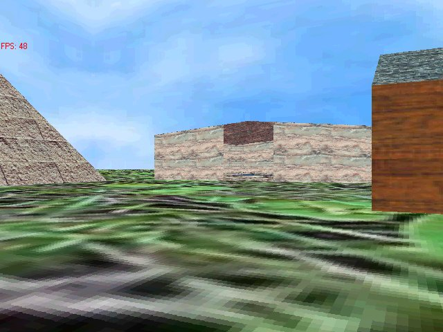



## Direct3D World

### Description

FIXED JUMPING. I updated the older 3d World. Now you can strafe and jump. And I also added a little sauna thing with animating water. You'll have to check it out to understand. Check out the "Keys.txt" text file for the controls. Please rate and give feedback on what else I should implement.
 
### More Info
 

             |
---                |---
**Submitted On**   |2004-01-01 11:42:08
**By**             |[Jim DeLap](https://github.com/Planet-Source-Code/PSCIndex/blob/master/ByAuthor/jim-delap.md)
**Level**          |Advanced
**User Rating**    |4.9 (34 globes from 7 users)
**Compatibility**  |VB 6\.0
**Category**       |[DirectX](https://github.com/Planet-Source-Code/PSCIndex/blob/master/ByCategory/directx__1-44.md)
**World**          |[Visual Basic](https://github.com/Planet-Source-Code/PSCIndex/blob/master/ByWorld/visual-basic.md)
**Archive File**   |[Direct3D\_W168901112004\.zip](https://github.com/Planet-Source-Code/jim-delap-direct3d-world__1-50571/archive/master.zip)

